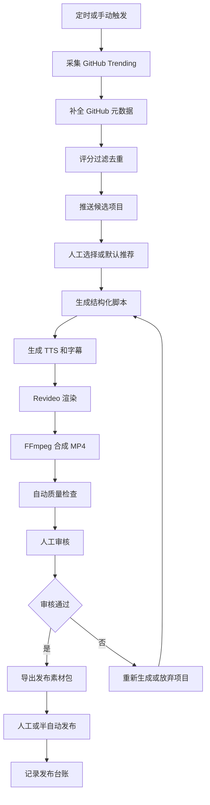

# GitHub 日榜推荐短视频自动化流水线详细设计

## 1. 文档目的

本文档基于 `doc/proposal.md` 和 `doc/high-level-design.md`，对 v1.0 MVP 的模块进行详细设计，明确每个模块的职责边界、输入输出、内部组件、异常处理、数据契约和独立测试方式。

本文档不替代未明确的产品或技术决策。对 PRD 和概要设计中未固定的事项，本文档采用接口抽象、配置项或待确认项表达，不直接选择具体供应商、存储产品或审核渠道。

## 2. 设计原则

- 模块间通过显式数据契约和 HTTP API 协作。
- 执行面模块尽量无状态，状态以任务记录和产物 URL 为准。
- 外部服务通过 Adapter 隔离，避免锁死在单一 LLM、TTS、存储或发布网关。
- 长耗时任务采用异步任务模型。
- 人工审核是发布前的强制节点。
- 每个模块必须可用模拟输入独立测试。
- 失败必须可定位到具体阶段，并写入明确任务状态。

## 3. 模块清单

| 模块 | 模块名 | 主要职责 |
| --- | --- | --- |
| 控制面 | n8n 控制面 | 触发、编排、状态流转、通知、人工确认、台账协调 |
| 采集 | GitHub 采集模块 | 获取 Trending 候选项目并补全元数据 |
| 评分 | 评分与去重模块 | 过滤、打分、去重、风险标记、推荐候选 |
| 内容 | 内容生成模块 | 生成结构化脚本、标题、简介、标签、封面文案和 CTA |
| 音频字幕 | TTS 与字幕模块 | 生成配音音频和字幕时间戳 |
| 渲染 | 视频渲染模块 | 使用 Revideo 和 FFmpeg 生成竖屏 MP4 与封面 |
| 审核 | 人工审核模块 | 展示审核对象，接收通过、拒绝和备注 |
| 发布 | 发布素材与台账模块 | 输出发布素材包，记录人工或半自动发布台账 |
| 存储 | 存储层 | 保存对象产物、任务状态、候选项目和发布记录 |
| 质量 | 自动质量检查模块 | 在人工审核前检查产物完整性和基础质量 |

## 4. 全局数据契约

### 4.1 通用响应格式

所有执行面接口使用统一响应结构。模块可以扩展 `data`，但不得改变顶层字段含义。

```json
{
  "success": true,
  "requestId": "req_20260522_001",
  "data": {},
  "error": null
}
```

失败响应：

```json
{
  "success": false,
  "requestId": "req_20260522_001",
  "data": null,
  "error": {
    "code": "GITHUB_TRENDING_FETCH_FAILED",
    "message": "GitHub Trending fetch failed",
    "retryable": true,
    "detail": {}
  }
}
```

### 4.2 通用错误字段

| 字段 | 类型 | 必填 | 说明 |
| --- | --- | --- | --- |
| `code` | string | 是 | 机器可读错误码 |
| `message` | string | 是 | 人类可读错误说明 |
| `retryable` | boolean | 是 | 是否允许自动重试 |
| `detail` | object | 否 | 调试上下文，不包含明文密钥 |

### 4.3 任务状态

任务状态沿用 PRD 定义：

- `created`
- `collected`
- `scored`
- `script_generated`
- `tts_generated`
- `rendering`
- `rendered`
- `review_pending`
- `approved`
- `rejected`
- `published_manual`
- `failed`

状态更新必须记录：

- 当前状态。
- 上一个状态。
- 更新时间。
- 阶段名称。
- 失败错误码。
- 可追溯日志或产物引用。

## 5. 存储层详细设计

### 5.1 职责

存储层为其他模块提供统一的数据读写和对象产物引用能力。PRD 未指定具体数据库、表格或对象存储产品，因此本设计只定义逻辑模型和访问边界。

### 5.2 逻辑存储对象

| 对象 | 用途 |
| --- | --- |
| `CandidateRepository` | 保存候选项目和采集结果 |
| `VideoTask` | 保存视频生成任务和状态 |
| `GeneratedAsset` | 保存脚本、音频、字幕、封面、视频等对象产物元数据 |
| `PublishRecord` | 保存平台发布台账 |
| `DedupRecord` | 保存近期已生成或已跳过项目 |
| `ModuleRunLog` | 保存模块执行日志、错误码和耗时 |

### 5.3 CandidateRepository

```json
{
  "repoFullName": "owner/name",
  "repoUrl": "https://github.com/owner/name",
  "description": "项目简介",
  "language": "TypeScript",
  "topics": ["ai", "developer-tools"],
  "stars": 12000,
  "forks": 800,
  "todayStars": 500,
  "readmeText": "README 文本",
  "readmeSummary": "README 摘要",
  "createdAt": "2026-05-20T00:00:00Z",
  "updatedAt": "2026-05-22T00:00:00Z",
  "license": "MIT",
  "source": "github_trending",
  "collectedAt": "2026-05-22T09:00:00Z",
  "score": 87,
  "scoreBreakdown": {},
  "riskFlags": ["star_spike"],
  "recommendReason": "README 清晰，近期热度高，适合开发者受众"
}
```

约束：

- `repoFullName` 应作为候选项目的业务唯一键。
- `repoUrl` 必须为 GitHub 仓库 URL。
- `riskFlags` 为空数组表示未发现风险提示。
- `scoreBreakdown` 用于解释评分，不参与跨模块强依赖。

### 5.4 VideoTask

```json
{
  "taskId": "task_20260522_001",
  "repoFullName": "owner/name",
  "status": "rendered",
  "statusHistory": [
    {
      "from": "rendering",
      "to": "rendered",
      "changedAt": "2026-05-22T09:08:00Z",
      "reason": "render completed"
    }
  ],
  "selectedBy": "manual",
  "scriptAssetId": "asset_script_001",
  "audioAssetId": "asset_audio_001",
  "subtitleAssetId": "asset_subtitle_001",
  "videoAssetId": "asset_video_001",
  "coverAssetId": "asset_cover_001",
  "createdAt": "2026-05-22T09:00:00Z",
  "updatedAt": "2026-05-22T09:08:00Z",
  "lastError": null
}
```

约束：

- `taskId` 必须贯穿所有模块调用。
- 状态只能按允许的状态边迁移。
- 失败时必须写入 `lastError`。

### 5.5 GeneratedAsset

```json
{
  "assetId": "asset_video_001",
  "taskId": "task_20260522_001",
  "type": "video",
  "url": "https://storage.example/video.mp4",
  "contentType": "video/mp4",
  "sizeBytes": 12345678,
  "checksum": "sha256:...",
  "createdAt": "2026-05-22T09:08:00Z",
  "metadata": {
    "durationSec": 75,
    "width": 1080,
    "height": 1920,
    "fps": 30
  }
}
```

### 5.6 PublishRecord

```json
{
  "taskId": "task_20260522_001",
  "platform": "douyin",
  "title": "这个 GitHub 项目一天爆火，开发者都在收藏",
  "description": "项目简介与使用场景",
  "hashtags": ["GitHub", "开源", "程序员"],
  "publishedAt": "2026-05-22T12:00:00Z",
  "publishUrl": "https://example.com/video",
  "operator": "manual",
  "createdAt": "2026-05-22T12:05:00Z"
}
```

### 5.7 独立测试

- 使用内存数据库或临时表模拟候选项目、任务和发布记录。
- 验证 `repoFullName` 去重。
- 验证任务状态非法迁移会被拒绝。
- 验证对象产物 URL 和元数据可以被查询。
- 验证失败错误不会丢失 `taskId` 和阶段信息。

## 6. n8n 控制面详细设计

### 6.1 职责

n8n 控制面负责流程编排，不实现业务算法，不直接生成脚本、音频或视频。

### 6.2 工作流

#### 6.2.1 每日采集工作流

触发方式：

- 定时触发。
- 手动触发。

步骤：

1. 创建或读取当日批次。
2. 调用 `POST /api/jobs/collect-github-daily`。
3. 保存候选项目。
4. 调用评分与去重模块。
5. 向运营者推送 3-5 个候选项目和推荐理由。
6. 等待人工选择或接受默认推荐。

#### 6.2.2 视频生成工作流

步骤：

1. 创建 `VideoTask`，状态为 `created`。
2. 绑定选中的 `repoFullName`。
3. 调用内容生成模块。
4. 成功后更新状态为 `script_generated`。
5. 调用 TTS 与字幕模块。
6. 成功后更新状态为 `tts_generated`。
7. 调用视频渲染模块。
8. 更新状态为 `rendering`。
9. 等待 Webhook 回调或轮询渲染状态。
10. 成功后更新状态为 `rendered`。
11. 调用自动质量检查。
12. 通过后进入 `review_pending`。

#### 6.2.3 审核发布工作流

步骤：

1. 创建审核入口或发送审核通知。
2. 等待审核决策。
3. 审核通过后更新为 `approved`。
4. 生成发布素材包。
5. 人工或半自动发布完成后写入发布记录。
6. 更新为 `published_manual`。
7. 审核拒绝后更新为 `rejected`，根据动作重新生成或放弃项目。

### 6.3 模块接口依赖

| 下游模块 | 调用方式 | 失败处理 |
| --- | --- | --- |
| 采集模块 | HTTP 同步返回采集结果或 jobId | 重试，失败后备用采集逻辑 |
| 评分模块 | HTTP 同步评分 | 失败后标记当日任务失败并通知人工 |
| 内容生成模块 | HTTP 同步或异步 | JSON 异常按 LLM 异常策略重试 |
| TTS 模块 | HTTP 同步或异步 | 音频失败不进入渲染 |
| 渲染模块 | HTTP 异步 | 回调或轮询，失败后允许相同素材重渲染 |
| 审核模块 | 表单或通知回调 | 超时策略未在 PRD 指定，标为待确认 |
| 发布台账模块 | HTTP 或数据写入 | 失败时通知人工补录 |

### 6.4 待确认配置

- 审核入口具体使用 n8n 表单、企业微信、Telegram、飞书还是 Web 面板。
- 渲染完成通知使用 Webhook 还是轮询。
- 人工选择候选项目的超时策略。
- 失败通知渠道。

### 6.5 独立测试

- 使用 Mock HTTP 服务模拟所有执行面模块。
- 验证正常流程能从 `created` 到 `review_pending`。
- 验证渲染异步回调能更新任务状态。
- 验证任一模块失败会写入 `failed` 或对应重试状态。
- 验证审核拒绝后可以触发重新生成脚本、重新生成配音、重新渲染或放弃项目。

## 7. GitHub 采集模块详细设计

### 7.1 职责

采集模块负责获取 GitHub 日榜候选项目，并补全后续评分和内容生成所需的仓库元数据。

### 7.2 输入

```json
{
  "language": "all",
  "since": "daily",
  "limit": 20
}
```

字段说明：

| 字段 | 说明 |
| --- | --- |
| `language` | GitHub Trending 语言筛选，默认 `all` |
| `since` | Trending 时间范围，MVP 使用 `daily` |
| `limit` | 返回候选数量上限 |

### 7.3 输出

```json
{
  "jobId": "collect_001",
  "candidates": [
    {
      "repoFullName": "owner/name",
      "repoUrl": "https://github.com/owner/name",
      "description": "项目简介",
      "language": "TypeScript",
      "topics": ["ai", "developer-tools"],
      "stars": 12000,
      "forks": 800,
      "todayStars": 500,
      "readmeText": "README 文本",
      "readmeSummary": "README 摘要",
      "createdAt": "2026-05-20T00:00:00Z",
      "updatedAt": "2026-05-22T00:00:00Z",
      "license": "MIT"
    }
  ]
}
```

### 7.4 内部组件

| 组件 | 职责 |
| --- | --- |
| `TrendingPageFetcher` | 使用 Playwright 抓取 Trending 页面 |
| `TrendingParser` | 从页面提取仓库名、URL、描述和今日热度信号 |
| `GitHubMetadataClient` | 通过 GitHub REST API 或 GraphQL API 补全仓库详情 |
| `ReadmeFetcher` | 获取 README 文本 |
| `CandidateNormalizer` | 统一字段、清理空值、格式化时间 |
| `CollectionResultWriter` | 写入候选项目和采集日志 |

### 7.5 处理流程

1. 校验请求参数。
2. 使用 Playwright 打开 GitHub Trending 页面。
3. 提取最多 `limit` 个候选仓库。
4. 对每个仓库调用 GitHub API 补全元数据。
5. 获取 README 内容或摘要。
6. 标准化候选项目字段。
7. 写入候选项目记录。
8. 返回候选列表。

### 7.6 异常处理

| 场景 | 处理 |
| --- | --- |
| Trending 页面抓取失败 | 等待 1-3 分钟重试 |
| 重试仍失败 | 切换到 GitHub Search API 备选逻辑 |
| API 速率限制 | 标记可重试错误并通知控制面 |
| README 缺失 | 保留空值或摘要为空，交由评分模块过滤 |
| 链接异常 | 标记候选无效，不进入评分 |

### 7.7 独立测试

- 使用固定 HTML 样本测试 `TrendingParser`。
- 使用 Mock GitHub API 测试元数据补全。
- 验证 README 缺失时不会崩溃。
- 验证 `limit` 能限制返回数量。
- 验证异常页面会返回可重试错误。
- 验证标准化后的候选对象满足数据契约。

## 8. 评分与去重模块详细设计

### 8.1 职责

评分与去重模块负责把候选项目转化为 3-5 个可推荐项目，并解释推荐理由和风险提示。

### 8.2 输入

```json
{
  "jobId": "collect_001",
  "candidates": [],
  "targetCount": 5
}
```

### 8.3 输出

```json
{
  "jobId": "score_001",
  "recommended": [
    {
      "repoFullName": "owner/name",
      "score": 87,
      "scoreBreakdown": {
        "trendingHeat": 20,
        "starProof": 15,
        "readmeExplainability": 18,
        "audienceRelevance": 20,
        "freshness": 14,
        "duplicatePenalty": 0,
        "abnormalPenalty": 0
      },
      "riskFlags": ["star_spike"],
      "recommendReason": "热度高、README 清晰、适合开发者受众"
    }
  ]
}
```

### 8.4 内部组件

| 组件 | 职责 |
| --- | --- |
| `CandidateFilter` | 排除无效、低质量、README 不可解释项目 |
| `DedupChecker` | 查询近期已生成视频的仓库 |
| `RuleScorer` | 按规则计算推荐分 |
| `RiskFlagger` | 标记异常 Star、创建时间极短等风险 |
| `RecommendationSelector` | 选出 3-5 个候选项目 |
| `ScoreExplainer` | 生成推荐理由 |

### 8.5 规则设计

评分模块只使用 PRD 指定的规则评分方向，不引入机器学习模型。

推荐分由以下分项组成：

- 日榜热度分。
- 总 Star 背书分。
- README 可解释性分。
- AI/开发工具相关性分。
- 项目新鲜度分。
- 重复题材惩罚。
- 异常项目惩罚。

具体权重 PRD 未固定，详细设计将其定义为配置项，不在本文档中硬编码数值。

### 8.6 过滤规则

必须过滤：

- README 过短或无法解释核心用途的项目。
- 描述为空的项目。
- 链接异常的项目。
- 明显无关或低质量仓库。
- 近期已生成过视频的仓库。

降低优先级：

- 非中文受众难以理解的纯内部库。
- 极窄领域项目。
- 创建时间极短但 Star 异常飙升的项目。

### 8.7 独立测试

- 使用固定候选列表测试过滤规则。
- 使用历史发布记录测试去重。
- 验证高风险项目会产生 `riskFlags`。
- 验证目标输出数量为 3-5 个，除非有效候选不足。
- 验证推荐理由非空。
- 验证评分结果可解释。

## 9. 内容生成模块详细设计

### 9.1 职责

内容生成模块根据候选项目元数据和 README 摘要生成短视频脚本及发布文案。

### 9.2 输入

```json
{
  "repoFullName": "owner/name",
  "style": "code_ppt",
  "durationSec": 75,
  "audience": "chinese_developers"
}
```

### 9.3 输出

```json
{
  "jobId": "script_001",
  "script": {
    "title": "视频标题",
    "coverText": "封面文案",
    "description": "发布简介",
    "hashtags": ["GitHub", "开源项目", "AI工具"],
    "segments": [
      {
        "type": "hook",
        "durationSec": 5,
        "voiceText": "配音文本",
        "screenText": "屏幕主字幕",
        "visualHint": "视觉提示",
        "emotion": "excited"
      }
    ],
    "cta": "结尾引导"
  }
}
```

### 9.4 内部组件

| 组件 | 职责 |
| --- | --- |
| `ProjectContextBuilder` | 组装仓库元数据、README 摘要、评分理由和风险提示 |
| `ModelAdapter` | 隔离 DeepSeek、OpenAI、Claude、Gemini 或本地模型 |
| `SummaryGenerator` | 生成项目摘要、标题候选和标签 |
| `ScriptGenerator` | 生成最终结构化脚本 |
| `ScriptSchemaValidator` | 校验 JSON 结构和必填字段 |
| `FactGuard` | 检查脚本事实是否来自元数据或 README |
| `ScriptRepairer` | JSON 解析失败时触发修复提示 |
| `ScriptAssetWriter` | 保存脚本 JSON 到对象存储 |

### 9.5 生成约束

脚本必须满足：

- 前 3 秒直接给出悬念、痛点或强利益点。
- 不使用“大家好，今天介绍”类低效开场。
- 用普通开发者能理解的话解释项目价值。
- 明确说明项目解决什么问题、为什么火、适合谁用。
- 包含 GitHub 项目名、核心能力、技术亮点和使用场景。
- 不夸大项目能力。
- 不编造 README 或元数据未出现的事实。
- 结尾包含收藏、评论区获取链接或关注后续推荐 CTA。

### 9.6 事实约束

内容生成模块不得把以下内容作为事实输出，除非元数据或 README 明确存在：

- 性能指标。
- 融资信息。
- 官方背书。
- 用户数量。
- 商业合作。
- 未验证能力。

当事实字段缺失时：

- 优先使用已有元数据。
- 不能让模型自行补全事实。
- 必要时输出更保守的描述。

### 9.7 异常处理

| 场景 | 处理 |
| --- | --- |
| LLM 返回非 JSON | 使用修复提示词重试 |
| JSON Schema 校验失败 | 修复或重试 |
| 事实字段缺失 | 回退到元数据，避免编造 |
| 连续失败 3 次 | 标记任务失败并通知人工 |
| 标题或简介为空 | 视为生成失败 |

### 9.8 独立测试

- 使用固定候选项目元数据测试脚本生成。
- 使用 Mock ModelAdapter 返回合法 JSON，验证解析。
- 使用 Mock ModelAdapter 返回非法 JSON，验证修复流程。
- 验证缺少 README 时不编造事实。
- 验证输出包含 `title`、`coverText`、`description`、`hashtags`、`segments`、`cta`。
- 验证每个 segment 包含配音文本和屏幕字幕。

## 10. TTS 与字幕模块详细设计

### 10.1 职责

TTS 与字幕模块负责将结构化脚本中的配音文本转换为音频，并生成字幕时间戳。

### 10.2 输入

```json
{
  "taskId": "task_001",
  "voice": "default_cn_tech",
  "script": {}
}
```

### 10.3 输出

```json
{
  "audioUrl": "https://storage.example/audio.mp3",
  "subtitleUrl": "https://storage.example/subtitles.json",
  "srtUrl": "https://storage.example/subtitles.srt"
}
```

### 10.4 内部组件

| 组件 | 职责 |
| --- | --- |
| `VoiceTextAssembler` | 从 segments 中合并配音文本和情绪提示 |
| `TTSAdapter` | 调用 Fish Audio 或同等能力服务 |
| `TimestampNormalizer` | 统一词级、短句级或句级时间戳 |
| `SubtitleBuilder` | 生成字幕 JSON |
| `SrtExporter` | 必要时导出 SRT |
| `AudioAssetWriter` | 保存音频文件 |
| `SubtitleAssetWriter` | 保存字幕文件 |

### 10.5 字幕 JSON

```json
{
  "taskId": "task_001",
  "level": "phrase",
  "items": [
    {
      "text": "配音文本",
      "startMs": 0,
      "endMs": 1200,
      "segmentIndex": 0
    }
  ]
}
```

约束：

- `startMs` 必须小于 `endMs`。
- 字幕项必须按时间递增。
- 字幕文本应能对应脚本中的配音文本。
- 时间戳缺失时，允许降级为句级字幕。

### 10.6 异常处理

| 场景 | 处理 |
| --- | --- |
| TTS 调用失败 | 重试 |
| 音频生成失败 | 任务不得进入渲染阶段 |
| 时间戳缺失 | 降级为句级字幕 |
| 字幕时间戳不递增 | 标记 TTS 阶段失败 |
| 音频文件不可访问 | 标记 TTS 阶段失败 |

### 10.7 独立测试

- 使用固定脚本生成音频请求文本。
- 使用 Mock TTSAdapter 返回音频和时间戳。
- 验证字幕时间戳递增。
- 验证词级时间戳缺失时可降级为句级字幕。
- 验证音频失败时不会输出可渲染结果。
- 验证导出的字幕 JSON 满足渲染模块输入契约。

## 11. 视频渲染模块详细设计

### 11.1 职责

视频渲染模块负责把脚本、音频和字幕渲染为 9:16 竖屏短视频，并输出封面图。

### 11.2 输入

```json
{
  "taskId": "task_001",
  "template": "github_daily_code_ppt_v1",
  "scriptUrl": "https://storage.example/script.json",
  "audioUrl": "https://storage.example/audio.mp3",
  "subtitleUrl": "https://storage.example/subtitles.json"
}
```

### 11.3 输出

```json
{
  "renderJobId": "render_001",
  "status": "rendering"
}
```

渲染完成产物：

```json
{
  "taskId": "task_001",
  "renderJobId": "render_001",
  "status": "rendered",
  "videoUrl": "https://storage.example/video.mp4",
  "coverUrl": "https://storage.example/cover.png",
  "metadata": {
    "width": 1080,
    "height": 1920,
    "fps": 30,
    "durationSec": 75,
    "videoCodec": "H.264",
    "audioCodec": "AAC"
  }
}
```

### 11.4 内部组件

| 组件 | 职责 |
| --- | --- |
| `RenderJobManager` | 创建、查询和更新渲染任务 |
| `RenderInputLoader` | 下载或读取脚本、音频、字幕 |
| `TemplateDataMapper` | 把脚本结构映射为 Revideo 模板参数 |
| `RevideoRenderer` | 渲染视频画面 |
| `FfmpegComposer` | 合成音频、视频并编码 |
| `CoverGenerator` | 生成封面图 |
| `RenderAssetWriter` | 保存 MP4 和封面 |
| `RenderCallbackSender` | 回调 n8n 或供 n8n 轮询状态 |

### 11.5 模板要求

模板必须支持：

- 开场 Hook。
- 项目卡片。
- 2-3 个核心卖点。
- README、终端效果、项目 UI 或代码片段展示。
- 动态字幕逐句或逐词高亮。
- 结尾 CTA。

模板不得：

- 为单个项目硬编码画面。
- 使用数字人或虚拟主播。
- 使用过度花哨转场。
- 让单屏主信息超过 3 行。

### 11.6 成片规格

| 项 | 值 |
| --- | --- |
| 比例 | 9:16 |
| 分辨率 | 1080x1920 |
| 帧率 | 30fps |
| 时长 | 60-90 秒 |
| 视频编码 | H.264 |
| 容器 | MP4 |
| 音频编码 | AAC |

### 11.7 异常处理

| 场景 | 处理 |
| --- | --- |
| 脚本文件不可访问 | 渲染失败，记录错误 |
| 音频文件不可访问 | 渲染失败，记录错误 |
| 字幕文件不可访问 | 渲染失败，记录错误 |
| Revideo 渲染失败 | 记录错误日志，允许相同素材重渲染 |
| FFmpeg 合成失败 | 记录错误日志，允许相同素材重渲染 |
| 连续失败 | 通知人工，不进入审核 |

### 11.8 独立测试

- 使用固定脚本、测试音频和字幕渲染样片。
- 验证输出分辨率为 1080x1920。
- 验证输出时长在 60-90 秒。
- 验证输出编码为 H.264 和 AAC。
- 验证字幕时间轴能正确映射到画面。
- 验证相同输入可以重渲染。
- 验证文件缺失时返回明确错误码。

## 12. 自动质量检查模块详细设计

### 12.1 职责

自动质量检查模块在人工审核前执行基础产物检查，避免明显失败产物进入审核。

### 12.2 输入

```json
{
  "taskId": "task_001",
  "scriptUrl": "https://storage.example/script.json",
  "audioUrl": "https://storage.example/audio.mp3",
  "subtitleUrl": "https://storage.example/subtitles.json",
  "videoUrl": "https://storage.example/video.mp4",
  "coverUrl": "https://storage.example/cover.png"
}
```

### 12.3 输出

```json
{
  "taskId": "task_001",
  "passed": true,
  "checks": [
    {
      "name": "video_playable",
      "passed": true,
      "message": "video is playable"
    }
  ]
}
```

### 12.4 检查项

- 视频文件存在且可播放。
- 音频时长与视频时长差异不超过 1 秒。
- 字幕文件存在且时间戳递增。
- 标题不为空。
- 简介不为空。
- GitHub 链接有效。
- 脚本中没有明显占位符或 JSON 解析失败残留。
- 不包含明显虚构事实，例如不存在的性能指标、融资信息或官方背书。

### 12.5 独立测试

- 使用可播放视频验证通过路径。
- 使用损坏视频验证失败路径。
- 使用乱序字幕验证失败路径。
- 使用空标题或空简介验证失败路径。
- 使用包含占位符的脚本验证失败路径。

## 13. 人工审核模块详细设计

### 13.1 职责

人工审核模块负责向审核人员展示待审核内容，并把审核决策回传给控制面。

### 13.2 审核对象

- GitHub 项目链接。
- 推荐理由和风险提示。
- 视频成片。
- 封面图或封面文案。
- 标题。
- 简介。
- 标签。
- 字幕和配音。

### 13.3 审核动作

```json
{
  "taskId": "task_001",
  "decision": "approved",
  "comment": "可以发布",
  "retryAction": null
}
```

拒绝示例：

```json
{
  "taskId": "task_001",
  "decision": "rejected",
  "comment": "标题夸大，需要重写",
  "retryAction": "regenerate_title_description"
}
```

允许的拒绝后动作：

- `regenerate_title_description`
- `regenerate_script`
- `regenerate_tts`
- `rerender_video`
- `abandon_and_select_next`

### 13.4 审核入口

PRD 允许通过 n8n 表单、企业微信、Telegram、飞书或简易 Web 面板完成审核。本文档不固定具体入口。

审核入口必须满足：

- 能展示审核对象。
- 能提交通过或拒绝。
- 能填写审核备注。
- 能选择或传递拒绝后的重试动作。
- 不绕过人工审核直接发布。

### 13.5 独立测试

- 使用固定审核任务验证展示字段完整。
- 验证 `approved` 能更新任务状态。
- 验证 `rejected` 能携带拒绝原因。
- 验证无效 `retryAction` 会被拒绝。
- 验证审核通过前不会生成发布完成状态。

## 14. 发布素材与台账模块详细设计

### 14.1 职责

发布素材与台账模块负责汇总发布素材包，并记录人工或半自动发布后的平台台账。

### 14.2 输入

```json
{
  "taskId": "task_001",
  "platforms": ["douyin", "wechat_channels", "bilibili", "xiaohongshu"]
}
```

### 14.3 输出

```json
{
  "taskId": "task_001",
  "packageUrl": "https://storage.example/packages/task_001.zip",
  "items": {
    "videoUrl": "https://storage.example/video.mp4",
    "coverUrl": "https://storage.example/cover.png",
    "title": "视频标题",
    "description": "发布简介",
    "hashtags": ["GitHub", "开源项目"],
    "repoUrl": "https://github.com/owner/name",
    "recommendedPublishTime": "2026-05-22T12:00:00Z",
    "platformNotes": {}
  }
}
```

### 14.4 台账写入

人工发布完成后补充：

```json
{
  "taskId": "task_001",
  "platform": "douyin",
  "publishUrl": "https://example.com/video",
  "publishedAt": "2026-05-22T12:00:00Z",
  "operator": "manual"
}
```

### 14.5 安全约束

- 不保存明文平台账号密码。
- 不绕过平台登录、验证码、审核或风控。
- 不抓取需要登录或违反服务条款的私有内容。
- 发布前必须保留人工确认。

### 14.6 独立测试

- 使用审核通过任务生成素材包。
- 验证素材包包含 MP4、封面、标题、简介、标签和 GitHub 链接。
- 验证发布记录可以补充平台链接。
- 验证未审核通过任务不能写入发布完成状态。
- 验证不会保存账号密码字段。

## 15. 模块间接口汇总

| 接口 | 调用方 | 提供方 | 同步性 |
| --- | --- | --- | --- |
| `POST /api/jobs/collect-github-daily` | n8n 控制面 | 采集模块 | 同步或返回 jobId |
| `POST /api/jobs/score-candidates` | n8n 控制面 | 评分与去重模块 | 同步 |
| `POST /api/jobs/generate-script` | n8n 控制面 | 内容生成模块 | 同步或异步 |
| `POST /api/jobs/generate-tts` | n8n 控制面 | TTS 与字幕模块 | 同步或异步 |
| `POST /api/jobs/render-video` | n8n 控制面 | 视频渲染模块 | 异步 |
| `GET /api/jobs/render-video/{renderJobId}` | n8n 控制面 | 视频渲染模块 | 同步查询 |
| `POST /api/jobs/quality-check` | n8n 控制面 | 自动质量检查模块 | 同步 |
| `POST /api/review/decision` | 审核入口 | n8n 控制面或审核模块 | 同步 |
| `POST /api/jobs/export-publish-package` | n8n 控制面 | 发布素材与台账模块 | 同步 |
| `POST /api/publish-records` | n8n 控制面 | 发布素材与台账模块 | 同步 |

说明：

- `score-candidates`、`quality-check`、`export-publish-package`、`publish-records` 是概要设计中隐含但未在 PRD API 章节列出的模块边界接口。它们服务于模块独立测试，不改变 PRD 业务范围。

## 16. 端到端状态流



## 17. 安全、合规与版权设计

### 17.1 内容来源

- 只使用公开 README、仓库元数据和官方链接。
- 不抓取需要登录或违反服务条款的私有内容。
- GitHub 项目介绍必须可追溯到公开来源。

### 17.2 生成内容

- 模型不得声称项目具备未验证能力。
- 事实字段缺失时必须保守表达。
- 自动检查和人工审核都需要关注事实错误。

### 17.3 资产版权

- 字体、背景音乐、音效和视觉素材必须具备可商用授权。
- PRD 未指定素材库或授权方案，后续实现需单独确认。

### 17.4 发布风险

- 不绕过平台登录、验证码、审核或风控机制。
- 不保存明文平台账号密码。
- 发布前必须人工确认。

## 18. 独立测试策略

### 18.1 模块测试

每个模块必须支持通过固定输入和 Mock 外部依赖进行独立测试。

| 模块 | 可独立测试的核心能力 |
| --- | --- |
| 采集模块 | HTML 解析、API 元数据补全、字段标准化 |
| 评分模块 | 过滤、评分、去重、风险标记 |
| 内容生成模块 | Prompt 输入构造、JSON Schema 校验、事实约束 |
| TTS 模块 | 文本拼接、字幕时间戳标准化、音频失败处理 |
| 渲染模块 | 模板参数映射、视频规格、失败重渲染 |
| 自动质量检查 | 视频可播放、字幕递增、标题简介非空 |
| 人工审核模块 | 决策回传、拒绝动作校验 |
| 发布台账模块 | 素材包导出、发布记录写入 |
| 存储层 | 状态迁移、对象产物查询、去重记录 |
| n8n 控制面 | 流程编排、状态更新、失败分支 |

### 18.2 契约测试

契约测试应覆盖：

- 请求和响应字段完整性。
- 错误结构一致性。
- 任务状态流转合法性。
- 对象产物 URL 可被下游读取。
- `taskId` 在所有模块调用中保持一致。

### 18.3 端到端冒烟测试

最小端到端测试路径：

1. 使用固定候选仓库或 Mock GitHub 数据。
2. 生成至少 3 个候选项目。
3. 选择一个项目。
4. 生成结构化脚本。
5. 生成音频和字幕。
6. 渲染 1080x1920 MP4。
7. 通过自动质量检查。
8. 进入人工审核。
9. 审核通过后导出发布素材包。
10. 写入发布台账。

## 19. 待确认项

以下事项由 PRD 和概要设计明确标为未固定，本详细设计不做替代决策：

- GitHub 元数据补全使用 REST API 还是 GraphQL API。
- 人工审核入口使用 n8n 表单、企业微信、Telegram、飞书还是简易 Web 面板。
- 渲染完成通知采用 Webhook 回调还是 n8n 轮询。
- 存储层具体选用数据库、表格、对象存储产品或组合。
- TTS 服务具体采用 Fish Audio 还是同等能力服务。
- LLM 供应商在 DeepSeek 默认方案之外的替换策略。
- 评分规则的具体权重数值。
- 人工候选选择和审核的超时策略。
- 失败通知渠道。
- 字体、背景音乐、音效和视觉素材授权来源。

## 20. MVP 完成标准

详细设计层面认为 MVP 完成需要满足：

- 每个模块都有明确输入、输出和错误边界。
- 每个模块可以用 Mock 依赖独立测试。
- 控制面可以串起完整任务链路。
- 生成产物可追溯到 `taskId`。
- 人工审核是发布前强制节点。
- 失败能定位到具体模块和阶段。
- 发布台账能记录人工或半自动发布结果。

