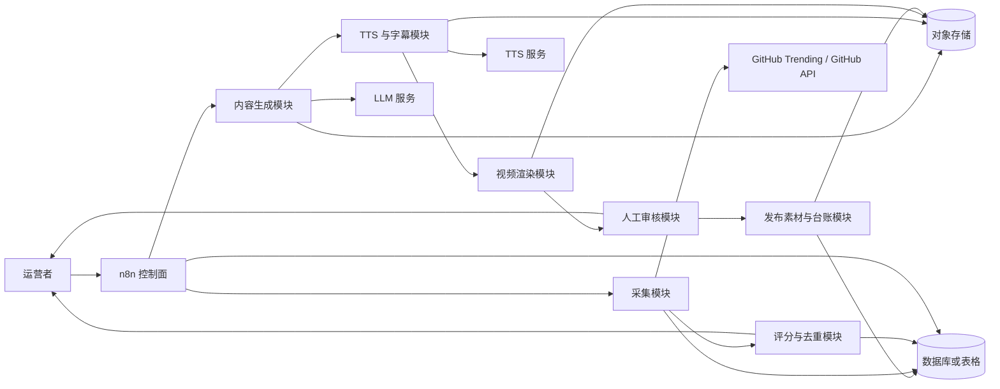
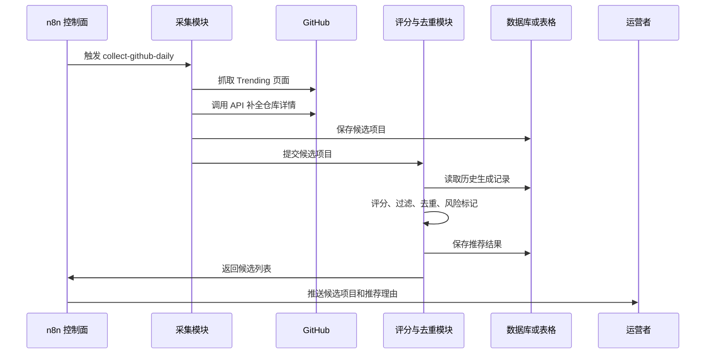
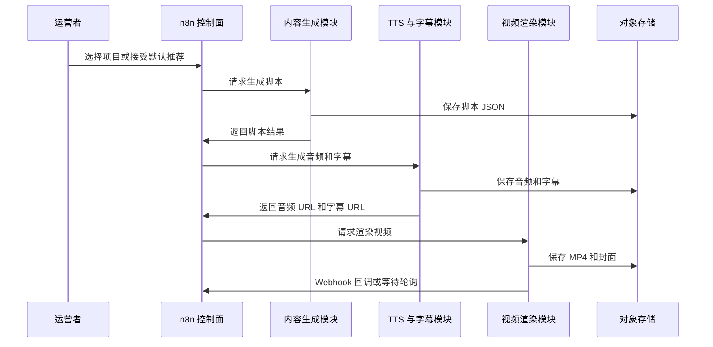
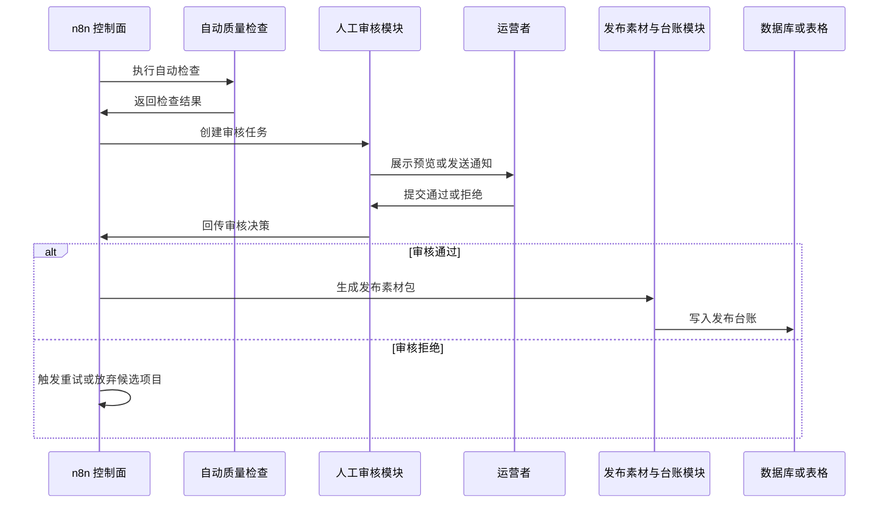
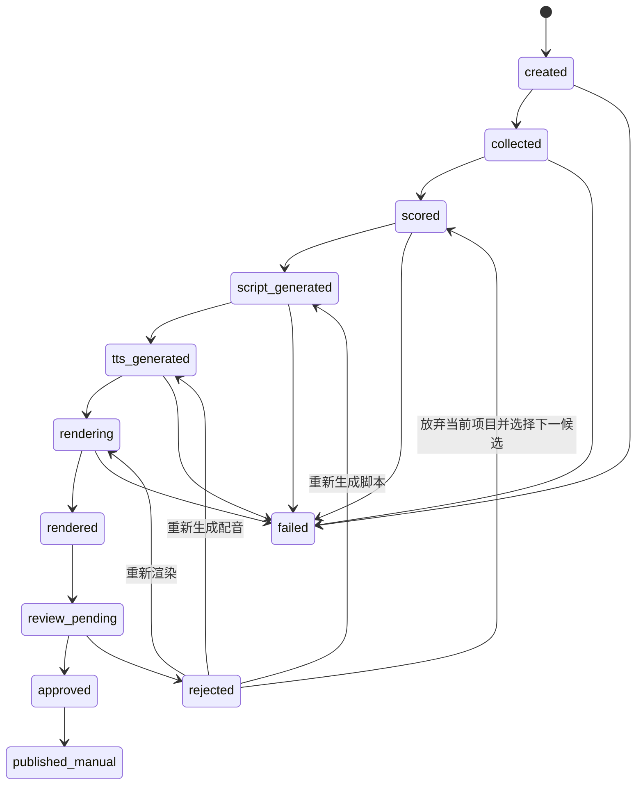

# GitHub 日榜推荐短视频自动化流水线概要设计

## 1. 文档目的

本文档根据 `proposal.md` 中的 PRD 内容，划分系统模块，说明模块职责、模块关系、核心流程、数据流、接口边界和异常处理设计。

本文档仅描述 PRD 已明确的 v1.0 MVP 范围，不引入未在 PRD 中声明的新功能或新技术决策。PRD 中以“或”“可选”“等价能力”描述的实现形态，在本文档中保留为可替换实现或待定项。

## 2. 设计范围

### 2.1 目标范围

- 每日采集 GitHub Trending 或等价热度来源中的候选项目。
- 补全候选项目元数据，并进行评分、过滤和去重。
- 生成结构化短视频脚本、标题、简介、标签、封面文案和 CTA。
- 生成 TTS 配音、字幕时间戳和竖屏短视频成片。
- 在发布前进入人工审核。
- 输出发布素材包，并记录发布台账。

### 2.2 非目标范围

- 不实现完全无人值守发布到国内平台。
- 不实现数字人口播、口型驱动或虚拟主播。
- 不实现多账号矩阵风控系统。
- 不实现复杂 A/B 测试平台。
- 不实现全网 AI 新闻爬虫聚合。
- 不训练私有大模型或 TTS 模型。
- 不自动绕过平台验证码、登录风控或审核机制。

## 3. 总体架构

系统采用“控制面 + 执行面 + 存储层 + 人工审核层”的架构。



## 4. 模块划分

### 4.1 n8n 控制面

职责：

- 触发定时任务或手动任务。
- 编排采集、评分、内容生成、TTS、渲染、审核和发布台账流程。
- 管理任务状态流转。
- 接收渲染回调或轮询任务状态。
- 发起人工审核表单或审核通知。
- 发送失败通知。
- 写入或更新任务台账。

关系：

- 调用执行面各模块提供的 HTTP API。
- 读取或写入任务状态、候选项目、发布记录。
- 将候选项目列表、审核入口和失败信息推送给运营者。

### 4.2 GitHub 采集模块

职责：

- 使用 Playwright 抓取 GitHub Trending 页面。
- 使用 GitHub REST API 或 GraphQL API 补全仓库详情。
- 生成候选项目列表。
- 提取仓库全名、URL、描述、语言、Topics、Star、Fork、今日热度信号、README 摘要、更新时间、创建时间和 License。

关系：

- 上游由 n8n 控制面触发。
- 下游向评分与去重模块提供候选项目数据。
- 向数据库或表格写入候选项目和采集结果。

### 4.3 评分与去重模块

职责：

- 根据 PRD 中的规则评分方向计算推荐分。
- 对候选项目执行过滤。
- 排除近期已生成过视频的仓库。
- 标记风险提示，例如创建时间极短但 Star 异常飙升。
- 输出 3-5 个候选项目和推荐理由。

评分因素：

- 日榜热度分。
- 总 Star 背书分。
- README 可解释性分。
- AI/开发工具相关性分。
- 项目新鲜度分。
- 重复题材惩罚。
- 异常项目惩罚。

关系：

- 接收采集模块输出的候选项目。
- 读取历史生成记录用于去重。
- 将候选列表交给 n8n 控制面，由控制面推送给运营者。

### 4.4 内容生成模块

职责：

- 生成项目摘要、标题候选、标签和最终脚本。
- 输出结构化 JSON 脚本。
- 避免生成未在 README 或元数据中出现的事实。
- 在字段缺失时回退到项目元数据，而不是让模型自行编造。

默认模型分工：

- DeepSeek V4 Flash：项目摘要、标题候选和标签。
- DeepSeek V4 Pro 或同级强推理模型：最终脚本。
- Model Adapter：抽象 LLM 供应商，保留 OpenAI、Claude、Gemini 或本地模型替换空间。

输出对象：

- 视频标题。
- 封面文案。
- 发布简介。
- 标签。
- 分段脚本。
- 配音文本。
- 屏幕主字幕。
- 视觉提示。
- 情绪提示。
- CTA。

关系：

- 接收运营者选择的候选项目。
- 读取候选项目元数据和 README 摘要。
- 调用 LLM 服务。
- 输出脚本 JSON 给 TTS 与字幕模块、视频渲染模块和发布素材模块。

### 4.5 TTS 与字幕模块

职责：

- 根据脚本文本生成中文自然口播音频。
- 根据 TTS 返回结果生成字幕时间戳。
- 支持情绪提示、停顿、强调和疑问等输入。
- 优先输出词级或短句级时间戳，最低支持句级时间戳。
- 必要时导出 SRT。

关系：

- 接收内容生成模块输出的脚本 JSON。
- 调用 Fish Audio 或具备同等能力的 TTS 服务。
- 将音频文件和字幕文件写入对象存储。
- 向视频渲染模块提供音频 URL 和字幕 URL。

### 4.6 视频渲染模块

职责：

- 使用 Revideo 作为程序化视频模板引擎。
- 使用 FFmpeg 进行音视频合成与编码。
- 生成 9:16、1080x1920、30fps、H.264、MP4、AAC 音频的竖屏成片。
- 渲染代码 PPT 风格画面。
- 支持动态字幕。
- 保证模板参数化，不为单个项目硬编码画面。

画面组成：

- 开场 Hook。
- 项目卡片。
- 2-3 个核心卖点。
- README、终端效果、项目 UI 或代码片段展示。
- 跟随 TTS 时间戳高亮的动态字幕。
- 结尾 CTA。

关系：

- 接收脚本 URL、音频 URL、字幕 URL 和模板参数。
- 输出 MP4 成片和封面图。
- 将产物写入对象存储。
- 渲染完成后回调 n8n，或由 n8n 轮询状态。

### 4.7 人工审核模块

职责：

- 在发布前展示或通知待审核内容。
- 支持审核通过、审核拒绝和审核备注。
- 支持对拒绝任务触发重试动作。

审核对象：

- 项目链接。
- 视频成片。
- 标题。
- 简介。
- 标签。
- 封面文案或封面图。
- 字幕与配音。

审核入口：

- PRD 指定该入口可通过 n8n 表单、企业微信、Telegram、飞书或简易 Web 面板实现。概要设计不固定具体渠道。

关系：

- 接收视频渲染模块产物和发布素材。
- 将审核决策回传给 n8n 控制面。
- 通过后进入发布素材导出和台账记录。
- 拒绝后进入重新生成或放弃候选项目流程。

### 4.8 发布素材与台账模块

职责：

- 汇总发布素材包。
- 记录发布台账。
- 在人工发布完成后补充平台链接。
- 不保存明文平台账号密码。

素材包内容：

- MP4 成片。
- 封面图。
- 标题。
- 简介。
- 标签。
- GitHub 项目链接。
- 推荐发布时间。
- 平台适配备注。

台账内容：

- 任务 ID。
- 发布平台。
- 标题。
- 简介。
- 标签。
- 发布时间。
- 发布链接。
- 操作方式。

关系：

- 接收人工审核通过的任务。
- 从对象存储读取成片、封面和中间产物。
- 写入发布记录。
- 支持抖音、视频号、B站、小红书的人工或半自动发布素材准备。

### 4.9 存储层

职责：

- 对象存储保存音频、字幕、封面、MP4、脚本和中间产物。
- 数据库或表格保存候选项目、视频任务、任务状态和发布记录。

说明：

- PRD 未指定具体数据库、表格产品或对象存储产品，概要设计保留为存储抽象。

## 5. 核心流程设计

### 5.1 每日候选项目采集流程



### 5.2 视频生成流程



### 5.3 审核与发布流程



## 6. 数据模型概要

### 6.1 候选项目

候选项目用于承载 GitHub 仓库元数据、评分结果和风险标记。

关键字段：

- `repoFullName`
- `repoUrl`
- `description`
- `language`
- `topics`
- `stars`
- `forks`
- `todayStars`
- `readmeText`
- `createdAt`
- `updatedAt`
- `score`
- `riskFlags`

### 6.2 视频任务

视频任务用于追踪一个项目从选择、脚本生成、TTS、渲染、审核到发布记录的全过程。

关键字段：

- `taskId`
- `repoFullName`
- `status`
- `scriptUrl`
- `audioUrl`
- `subtitleUrl`
- `videoUrl`
- `coverUrl`
- `createdAt`
- `updatedAt`

### 6.3 发布记录

发布记录用于记录人工或半自动发布后的平台台账。

关键字段：

- `taskId`
- `platform`
- `title`
- `description`
- `hashtags`
- `publishedAt`
- `publishUrl`
- `operator`

## 7. 状态流转设计

视频任务状态按 PRD 定义流转：



说明：

- `failed` 可由关键阶段失败进入。
- `rejected` 后的具体重试动作由审核意见或运营者选择决定。
- 发布完成状态为 `published_manual`，表示人工或半自动发布完成。

## 8. API 边界

### 8.1 采集候选项目

```http
POST /api/jobs/collect-github-daily
```

职责边界：

- 接收语言、时间范围和数量限制。
- 返回采集任务 ID 和候选项目列表。
- 不负责最终人工选择。

### 8.2 生成脚本

```http
POST /api/jobs/generate-script
```

职责边界：

- 接收仓库标识、风格、时长和受众。
- 返回结构化脚本。
- 不负责 TTS、渲染和发布。

### 8.3 生成音频

```http
POST /api/jobs/generate-tts
```

职责边界：

- 接收任务 ID、声音配置和脚本。
- 返回音频 URL 和字幕 URL。
- 若音频生成失败，任务不得进入渲染阶段。

### 8.4 渲染视频

```http
POST /api/jobs/render-video
```

职责边界：

- 接收任务 ID、模板、脚本 URL、音频 URL 和字幕 URL。
- 返回渲染任务 ID 和渲染状态。
- 渲染采用异步模式。

### 8.5 审核回调

```http
POST /api/review/decision
```

职责边界：

- 接收任务 ID、审核决策和审核备注。
- 更新任务审核状态。
- 不绕过人工审核直接发布。

## 9. 自动质量检查

任务进入人工审核前，应完成以下检查：

- 视频文件存在且可播放。
- 音频时长与视频时长差异不超过 1 秒。
- 字幕文件存在且时间戳递增。
- 标题不为空。
- 简介不为空。
- GitHub 链接有效。
- 脚本中没有明显占位符或 JSON 解析失败残留。
- 不包含明显虚构事实，例如不存在的性能指标、融资信息或官方背书。

自动检查通过后，任务进入 `review_pending`。

## 10. 异常处理概要

### 10.1 GitHub 采集失败

- 首次失败后等待 1-3 分钟重试。
- 重试仍失败时切换到 GitHub Search API 备选逻辑。
- 若仍失败，通知运营人员并结束当天任务。

### 10.2 LLM 输出异常

- JSON 解析失败时，使用修复提示词请求模型重新输出。
- 事实字段缺失时，回退到项目元数据。
- 连续失败 3 次后，标记任务失败并通知人工。

### 10.3 TTS 失败

- TTS 调用失败时重试。
- 时间戳缺失时，允许降级为句级字幕。
- 音频生成失败时，不进入渲染阶段。

### 10.4 渲染失败

- 记录 FFmpeg 和 Revideo 错误日志。
- 支持使用相同素材重新渲染。
- 连续失败后通知人工，不自动发布。

### 10.5 发布风险

- 首版不执行无人值守发布。
- 人工发布完成后再补充平台链接。
- 不保存明文平台账号密码。

## 11. 模块关系总结

| 上游模块 | 下游模块 | 关系说明 |
| --- | --- | --- |
| n8n 控制面 | 采集模块 | 触发每日或手动采集任务 |
| 采集模块 | 评分与去重模块 | 提供候选项目和元数据 |
| 评分与去重模块 | n8n 控制面 | 返回候选项目、推荐分、推荐理由和风险标记 |
| n8n 控制面 | 内容生成模块 | 基于运营者选择触发脚本生成 |
| 内容生成模块 | TTS 与字幕模块 | 提供结构化脚本和配音文本 |
| TTS 与字幕模块 | 视频渲染模块 | 提供音频和字幕时间戳 |
| 视频渲染模块 | 人工审核模块 | 提供成片、封面和预览素材 |
| 人工审核模块 | n8n 控制面 | 回传通过或拒绝决策 |
| n8n 控制面 | 发布素材与台账模块 | 审核通过后生成素材包并记录台账 |
| 各执行模块 | 存储层 | 保存中间产物、成品、任务状态和记录 |

## 12. 待定项

以下事项在 PRD 中未固定具体实现，概要设计保留为待定或可替换：

- GitHub 元数据补全使用 REST API 还是 GraphQL API。
- 人工审核入口使用 n8n 表单、企业微信、Telegram、飞书还是简易 Web 面板。
- 渲染完成通知采用 Webhook 回调还是 n8n 轮询。
- 存储层具体选用数据库、表格、对象存储产品或组合。
- TTS 服务具体采用 Fish Audio 还是同等能力服务。
- LLM 供应商在 DeepSeek 默认方案之外的替换策略。

这些待定项不影响 MVP 模块边界，但会影响后续详细设计和实现计划。

## 13. 验收映射

| PRD 验收项 | 覆盖模块 |
| --- | --- |
| 手动触发完整任务 | n8n 控制面 |
| 自动获取 GitHub 日榜候选项目 | 采集模块 |
| 展示至少 3 个候选项目及推荐理由 | 评分与去重模块、n8n 控制面 |
| 为选中项目生成结构化脚本 | 内容生成模块 |
| 生成配音和字幕时间戳 | TTS 与字幕模块 |
| 渲染 1080x1920 MP4 | 视频渲染模块 |
| 输出标题、简介、标签、封面和视频文件 | 内容生成模块、视频渲染模块、发布素材模块 |
| 进入人工审核流程 | 人工审核模块 |
| 记录发布台账 | 发布素材与台账模块 |
| 单次任务失败有明确错误状态 | n8n 控制面、任务状态流 |
| 关键阶段支持重试 | 异常处理、任务状态流 |
| 中间产物可追溯 | 存储层、视频任务模型 |
| 一天内重复运行不重复推荐同一项目 | 评分与去重模块 |

